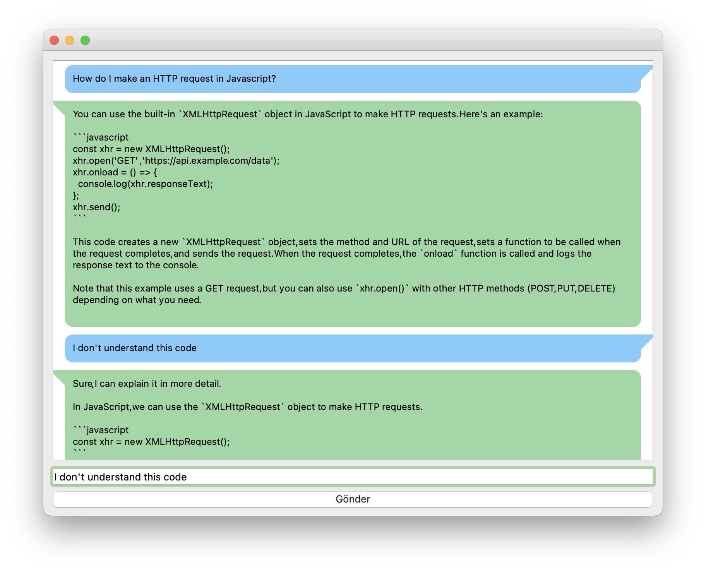

# OpenAI Chatbot
This project is a chatbot that uses the OpenAI API to generate responses to user messages. The chatbot is built using Python and the openai library.

## Screenshots

## Installation
1. Clone this repository to your local machine.
2. Install the required packages using pip install -r requirements.txt.
3. Open config.json file in the root directory and add your OpenAI API key as "openai key": "<your_api_key>".
4. Run python chatbot.py to start the chatbot.

## Usage
The chatbot will prompt the user to enter a message. Once the user has entered a message, the chatbot will use the OpenAI API to generate a response. The response will be displayed to the user, and the chatbot will prompt the user to enter another message.

## License
This project is licensed under the MIT License - see the LICENSE file for details.

